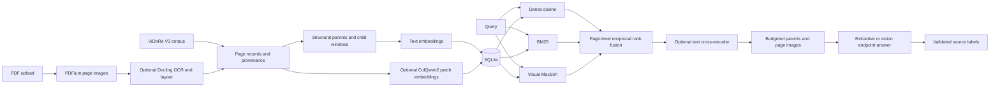

# Architecture

SQLite owns document, page, chunk, and vector records. Vectors use NumPy's non-pickle binary
format. Each ingestion computes vectors before atomically replacing the document; failed
database writes roll back. Foreign keys cascade deletes. Model/chunking configuration is
persisted and must match on restart. Migration 001 is mirrored in the package for installed
wheels; future schema changes need an explicit versioned migration.

Chunk IDs are page ID plus ordinal. Parents are Markdown sections, children are overlapping
word windows, and retrieval collapses child scores to the highest-scoring child per page.
Generation receives its parent section. Visual retrieval operates on the entire page.
RRF sums `1 / (60 + rank)` across active channels and deduplicates each list. The optional
text cross-encoder moves image-only pages after text-bearing candidates; disable it for pure
visual comparisons. Cosine retrieval assumes normalized text embeddings. MaxSim sums each
query token's best dot product against image tokens.

This is a single-process local reference implementation. An in-process lock protects API
ingestion/query operations and model calls; run one worker. Index reads load the corpus into
memory and scan it on every query. Full ViDoRe visual indexes can be large; a production
extension should move multi-vectors to a vector database and cache retrieval snapshots.

The hash encoder is lexical, not semantic. The baseline answer returns excerpts, not synthesis.
Optional dependencies load only when selected. Figure descriptions can be injected through
`enrich_figures(..., captioner=...)` and are marked as generated. The default Docling pipeline
exports source captions without calling a captioning service.

The API is unauthenticated and intended for trusted localhost use. Uploads check PDF headers,
byte limits, and page counts. For internet deployment add authentication, body limits at the
proxy (multipart parsing precedes route validation), parser isolation, quotas, rate limits,
job workers and artifact lifecycle management.
